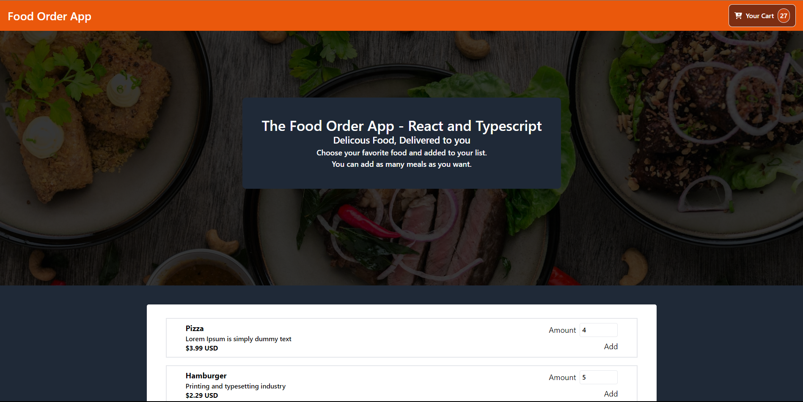
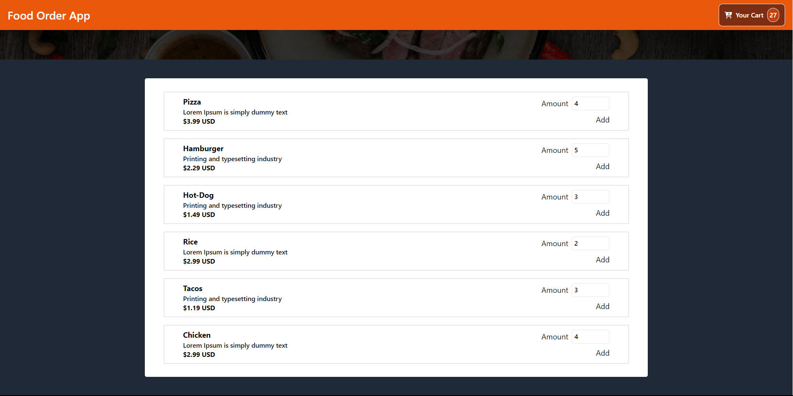
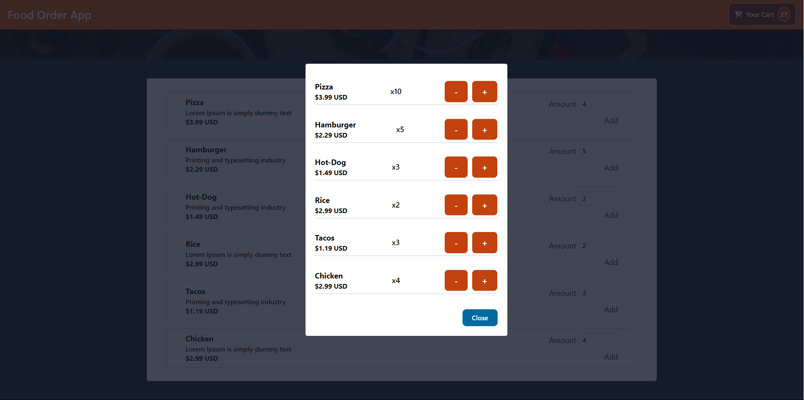

# The Food Order App. React and Typescript.

This is Food Order App where users can add meals to their carts, as well as remove items from it.

## Description.

Different meals will be shown on the landing page. This allows users to add meals to their carts by specifying the
amount of each item. In the navbar, there is a section where each user will see a list of items that they selected.

Two buttons located in the modal, can add and remove one item for each meal selected, depending on the user needs.

## Images.

## Stack.

* Typescript.
* React.

## React Techonlogies.

* useState.
* useEffect.
* useContext.

## Author.

* Jorge Ortiz.
* Software engineer.
